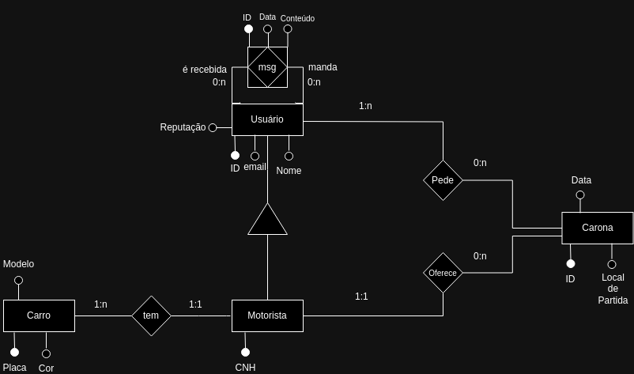

## **Projeto da Disciplina de Gerenciamento de Projeto e Manutenção de Software: Zé Carona**

## SUMÁRIO

1. [Equipe](#Equipe)
2. [Introdução](#INTRODUÇÃO)
3. [Arquitetura](#ARQUITETURA)
4. [Tecnologias](#TECNOLOGIAS_UTILIZADAS)
5. [Setup Local](#SETUP_LOCAL)

## ``Equipe``

``NaN (Not a Name)``
#  
|     Desenvolvedor       |    GitHub     |   LinkedIn   |
|-------------------------|---------------|--------------|
|👤 Camila Vieira Ferrari Correia|https://github.com/milabixcode|https://www.linkedin.com/in/camila-ferrari/|
|👤 Thales Fonseca Soares|https://github.com/ThalesFS|https://https://www.linkedin.com/in/thales-soares-712201253/|
|👤 Breno Silva Braido|https://github.com/BrenoSB98|https://www.linkedin.com/in/bbraido2/|

<br>

## ``INTRODUÇÃO``

Este projeto consiste em um sistema web para facilitar o compartilhamento de caronas entre membros da comunidade da Universidade Federal Fluminense. O objetivo é reduzir custos, promover a sustentabilidade e melhorar a mobilidade dentro da universidade, conectando pessoas que têm destinos semelhantes.

``Funcionalidades:``
1. Cadastro de Usuários: Permitir que usuários passageiros e motoristas da UFF se cadastrem no sistema, utilizando seu e-mail institucional. No caso de motorista, o sistema permite que ele cadastre as informações de seus veículos.
2. Oferta de Caronas: Usuários motoristas podem oferecer caronas indicando o ponto de partida, destino, horário disponível e número de assentos.
3. Busca de Caronas: Usuários passageiros podem buscar caronas disponíveis informando o ponto de partida e destino desejados.
4. Cancelamento de Caronas: Usuários passageiros ou motoristas podem cancelar caronas ativas.
5. Lista de caronas: Usuários motoristas e passageiros podem ver seu histórico de caronas.

<br>

## ``ARQUITETURA``
BANCO DE DADOS




<br>


### ``TECNOLOGIAS_UTILIZADAS``

* **Frontend:** `Desenvolvido em Mustache para a renderização de templates HTML.`
* **Backend:** `Desenvolvido em Java com Spring Boot, utilizando o Maven como gerenciador de dependências.`
* **Banco de dados:** `PostgresSQL`
* **API Client:** `Postman`
* **Conexão com o Banco de Dados:** `DBeaver`
* **Editor/IDE:** `Visual Studio Code`

<br>


## ``SETUP_LOCAL``


## ``Instalação Local``

Para rodar o projeto localmente:

1. Clone este repositório:

```git clone <URL_do_repositorio>```
```cd <nome_do_projeto>```

2. Configurar a conexão com o Banco de Dados no arquivo src/main/resources/application.properties

3. No terminal, navegue até a pasta raiz do projeto e execute o comando para subir a aplicação localmente:
```./mvnw spring-boot:run```


